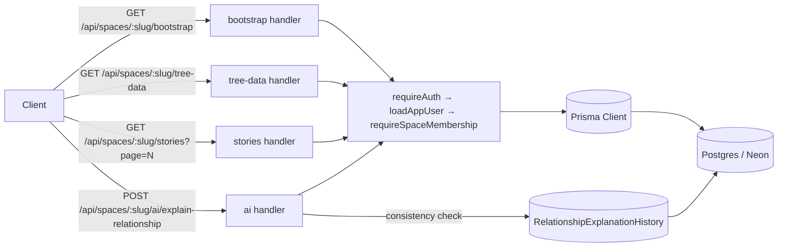

# Design Document

## Overview

This design describes how the WarisanAI API in `server/` will be optimized for query performance without changing any existing public contract. Three classes of change are introduced:

1. **Round-trip reduction.** Two new read-only endpoints — `GET /api/spaces/:spaceSlug/bootstrap` and `GET /api/spaces/:spaceSlug/tree-data` — let the client hydrate the app shell and the Family Tree view with a single request each, replacing the current pattern of parallel calls to `/api/spaces/:spaceSlug`, `/api/spaces/:spaceSlug/summary`, `/api/spaces/:spaceSlug/members`, `/api/spaces/:spaceSlug/branches`, and `/api/spaces/:spaceSlug/nuclear-families`.
2. **Payload shrink via narrow `select` shapes.** The Stories and Source Notes list endpoints currently `include` full related `FamilyMember`, `SourceNote`, and `Story` rows only to read a single `slugId` from each. They will be converted to nested `select: { slugId: true }` so biographies, notes, story content, and source-note content no longer travel over the wire. The `map*` functions in `server/routes/shared.ts` already consume only `slugId` from these relations, so the response shape is preserved.
3. **Opt-in pagination for heavy list endpoints.** Stories, Source Notes, Gallery, Timeline, `/api/platform/users`, and `/api/platform/spaces` gain `page` and `pageSize` query parameters. When neither is provided the current bare-array response is returned byte-for-byte unchanged. When at least one is provided the response switches to `{ items, page, pageSize, total, hasMore }` using the same per-item shape as today.

A fourth, smaller concern is covered for correctness: the AI relationship-explanation cache in `server/routes/aiRoutes.ts` must not return stale explanations after the family graph changes. The cache lookup remains keyed by `(familySpaceId, fromMemberId, toMemberId)`, but the code path gains a consistency check against the current graph and bypasses the cache when any member on the stored path has been deleted or has had its parent/spouse/sibling/child links changed.

All of this lives behind the existing middleware chain (`requireAuth`, `loadAppUser`, `requireSpaceMembership`, `requireSpaceRole`, `requirePlatformAdmin`). No route is loosened. Every query continues to be scoped by `familySpaceId` (or by `requirePlatformAdmin` for platform routes), and the Acceptance Check pair — `npm run build` and `npx prisma validate` — must stay green after the change.

### Design Goals

- Preserve every existing Response_Shape for callers that do not opt into the new endpoints or pagination.
- Keep the existing `map*` helpers in `server/routes/shared.ts` as the single source of truth for serialization.
- Reduce the number of columns read from Postgres for Stories and Source Notes list queries.
- Reduce the number of HTTP round-trips needed to open a space and to render the Family Tree.
- Make large lists pageable without forcing any current client to change.
- Keep multi-tenant isolation airtight: no query may leak data across `familySpaceId`.

### Non-Goals

- No schema migrations. The Prisma schema in `prisma/schema.prisma` is not modified.
- No changes to write routes (`POST`, `PUT`, `DELETE`). Their response shapes and behavior stay identical.
- No client-side refactor is required by this design; clients may opt in to the new endpoints and pagination at their own pace.
- No changes to authentication, role model, or rate limits.

## Architecture

### High-Level Flow



The middleware chain and Prisma client are unchanged. New handlers sit on top of the existing `Router` instances in `server/routes/`.

### Route Placement

- `GET /api/spaces/:spaceSlug/bootstrap` is registered on `spaceRoutes` (`server/routes/spaceRoutes.ts`) because it mirrors the read surface already owned by that router (`/api/spaces/:spaceSlug`, `/api/spaces/:spaceSlug/summary`, `/api/spaces/:spaceSlug/membership`). The chain `requireAuth, loadAppUser, requireSpaceMembership` — already aliased as `requireSpaceRead` — applies.
- `GET /api/spaces/:spaceSlug/tree-data` is registered on `memberRoutes` (`server/routes/memberRoutes.ts`) because the data it returns is a superset of `/api/spaces/:spaceSlug/members` and it shares that router's ordering and middleware chain.
- The pagination change is a purely handler-local change in `storyRoutes.ts`, `sourceNoteRoutes.ts`, `galleryRoutes.ts`, `timelineRoutes.ts`, and `platformRoutes.ts`.
- The relationship-cache safety change is local to `aiRoutes.ts`.

`server/routes/index.ts` needs no changes — each router already registers itself via `app.use()`.

### Backward Compatibility Strategy

Two rules govern every change:

- **Additive-only public surface.** The two new endpoints do not replace or deprecate anything. The narrowed `select` shapes on Stories/Source Notes preserve the output of `mapStory` and `mapSourceNote` exactly (they were already collapsing relations to `slugId` arrays). Pagination is off by default.
- **Backward-Compatible_Default for heavy lists.** The handler inspects `req.query.page` and `req.query.pageSize`. If both are absent (`undefined`), it runs the existing `findMany` with the existing `orderBy` and returns `res.json(items.map(mapX))` — a bare array, same element shape, same order. If either is present, it parses and validates them, clamps `pageSize` to `[1, 100]`, computes `skip = (page - 1) * pageSize`, runs the `findMany` with `skip`/`take` plus a `count` using the same `where`, and returns the paginated object.

### FamilySpace Isolation Invariant

Every query that touches a FamilySpace-scoped model must carry `familySpaceId: req.familySpace.id` in its `where` clause. This is already the pattern across `server/routes/`, and it is preserved as a hard rule in this design. The two new endpoints resolve `familySpaceId` through `requireSpaceMembership`, which attaches `req.familySpace`. Platform endpoints (`/api/platform/*`) do not carry a `familySpaceId`; they are gated by `requirePlatformAdmin` instead, which is unchanged.

## Components and Interfaces

### New Endpoint: `GET /api/spaces/:spaceSlug/bootstrap`

**Location:** `server/routes/spaceRoutes.ts`.

**Middleware chain:** `requireAuth, loadAppUser, requireSpaceMembership` (i.e. `requireSpaceRead`).

**Query parameters:**
- `include` — optional. When equal to the string `"coreData"`, the response additionally includes `members`, `branches`, and `nuclearFamilies` using the exact shapes produced by the Tree_Data_Endpoint. Any other value (including absence) is treated as "do not include core data".

**Response shape (default, `include` absent):**

```json
{
  "space":      { /* mapFamilySpace(req.familySpace) */ },
  "membership": { /* mapCurrentMembership(req.membership, req.familySpace) */ },
  "summary": {
    "membersCount":         0,
    "generationsCount":     0,
    "branchesCount":        0,
    "nuclearFamiliesCount": 0,
    "timelineCount":        0,
    "galleryCount":         0,
    "storiesCount":         0
  }
}
```

The `space` shape and `membership` shape match `GET /api/spaces/:spaceSlug` exactly. The `summary` shape matches `GET /api/spaces/:spaceSlug/summary` exactly — the existing computation will be extracted into a helper `computeSpaceSummary(familySpaceId)` so both endpoints stay byte-compatible. That helper lives in `server/routes/shared.ts` alongside the existing `map*` functions.

**Response shape (with `?include=coreData`):**

```json
{
  "space":      { /* … */ },
  "membership": { /* … */ },
  "summary":    { /* … */ },
  "members":        [ /* same shape as tree-data */ ],
  "branches":       [ /* same shape as tree-data */ ],
  "nuclearFamilies":[ /* same shape as tree-data */ ]
}
```

The `members`, `branches`, and `nuclearFamilies` arrays reuse the same helpers as the Tree_Data_Endpoint, and therefore use the tree-shaped member projection (no biography, no notes, no birthPlace). This is the explicit trade-off the `include=coreData` flag buys: fewer round-trips, but a tree-shaped member object (not the full-member shape returned by `/api/spaces/:spaceSlug/members`).

**Internal queries** (all scoped by `familySpaceId` derived from `req.familySpace.id`):
- `mapFamilySpace(req.familySpace)` — no query; `req.familySpace` is already loaded by `requireSpaceMembership`.
- `mapCurrentMembership(req.membership, req.familySpace)` — no query; `req.membership` is already loaded.
- `computeSpaceSummary(familySpaceId)` — runs the same `prisma.$transaction([...])` as the existing summary endpoint.
- On `include=coreData` only: the three tree queries defined below (`listTreeMembers`, `listBranches`, `listNuclearFamilies`).

**Failure modes:** unauthenticated → 401 from `requireAuth`; authenticated non-member → 403 from `requireSpaceMembership`; unknown `spaceSlug` → 404 from `requireSpaceMembership`. These mirror the existing space-scoped read routes exactly (Requirements 1.2, 1.3, 1.4).

### New Endpoint: `GET /api/spaces/:spaceSlug/tree-data`

**Location:** `server/routes/memberRoutes.ts`.

**Middleware chain:** identical to `GET /api/spaces/:spaceSlug/members` — `requireAuth, loadAppUser, requireSpaceMembership`.

**Response shape:**

```json
{
  "members":         [ /* tree member shape */ ],
  "branches":        [ /* mapBranch(...) */ ],
  "nuclearFamilies": [ /* mapNuclearFamily(...) */ ]
}
```

The `branches` and `nuclearFamilies` arrays go through the existing `mapBranch` and `mapNuclearFamily` helpers unchanged (Requirements 2.7, 2.8).

**Tree member shape** (Requirement 2.5 / 2.6). Only these keys, in this order:
`id, fullName, displayName, gender, generation, familyBranch, fatherId, motherId, spouseIds, formerSpouseIds, childrenIds, siblingIds, parentFamilyId, nuclearFamilyIds, birthDate, marriageDate, deathDate, isDeceased, deceasedLabel, photo, statusLabel, relationshipToRoot`.

The fields **not** present, compared to `mapMember`, are `biography`, `notes`, and `birthPlace`. This is enforced at the Prisma level with an explicit `select`, so those columns never cross the DB boundary.

**Ordering (Requirement 2.10):** `orderBy: [{ generation: "asc" }, { fullName: "asc" }]` — identical to `/api/spaces/:spaceSlug/members`.

**New helpers in `server/routes/shared.ts`:**

```ts
export const treeMemberSelect = {
  slugId: true,
  fullName: true,
  displayName: true,
  gender: true,
  generation: true,
  familyBranchId: true,
  fatherId: true,
  motherId: true,
  spouseIds: true,
  formerSpouseIds: true,
  childrenIds: true,
  siblingIds: true,
  parentFamilyId: true,
  nuclearFamilyIds: true,
  birthDate: true,
  marriageDate: true,
  deathDate: true,
  isDeceased: true,
  deceasedLabel: true,
  photo: true,
  statusLabel: true,
  relationshipToRoot: true,
} as const;

export const mapTreeMember = (member: any) => ({
  id: member.slugId,
  fullName: member.fullName,
  displayName: member.displayName,
  gender: member.gender,
  generation: member.generation,
  familyBranch: member.familyBranchId,
  fatherId: member.fatherId,
  motherId: member.motherId,
  spouseIds: member.spouseIds ?? [],
  formerSpouseIds: member.formerSpouseIds ?? [],
  childrenIds: member.childrenIds ?? [],
  siblingIds: member.siblingIds ?? [],
  parentFamilyId: member.parentFamilyId,
  nuclearFamilyIds: member.nuclearFamilyIds ?? [],
  birthDate: member.birthDate,
  marriageDate: member.marriageDate,
  deathDate: member.deathDate,
  isDeceased: member.isDeceased,
  deceasedLabel: member.deceasedLabel,
  photo: member.photo,
  statusLabel: member.statusLabel,
  relationshipToRoot: member.relationshipToRoot,
});
```

Both endpoints use these helpers so the tree member shape is defined in exactly one place.

### Narrowed `select` for Stories and Source Notes

**Stories list (`GET /api/spaces/:spaceSlug/stories`).** Current code uses:

```ts
include: {
  members:     { include: { member: true } },
  sourceNotes: { include: { sourceNote: true } },
},
```

This pulls every column of every related `FamilyMember` and every related `SourceNote`, including `biography`, `notes`, and `content`. The only data actually consumed by `mapStory` is `link.member.slugId` and `link.sourceNote.slugId`. The new shape is:

```ts
include: {
  members:     { select: { member:     { select: { slugId: true } } } },
  sourceNotes: { select: { sourceNote: { select: { slugId: true } } } },
},
```

Note the outer layer stays an `include` because we need the link row to exist to reach its `.member` / `.sourceNote` pointer, but we `select` only the nested `slugId`. `mapStory` continues to work unchanged because it already reads `link.member?.slugId` and `link.sourceNote?.slugId`.

The same pattern applies to `POST /api/spaces/:spaceSlug/stories`, which re-fetches via `findUniqueOrThrow` to produce the response. That `findUniqueOrThrow` uses the same narrowed shape.

**Source Notes list (`GET /api/spaces/:spaceSlug/source-notes`).** Analogous change:

```ts
include: {
  memberLinks: { select: { member: { select: { slugId: true } } } },
  storyLinks:  { select: { story:  { select: { slugId: true } } } },
},
```

Again, `mapSourceNote` already reads only `link.member?.slugId` and `link.story?.slugId`, so the response is identical.

### Pagination On Heavy List Endpoints

A single helper in `server/routes/shared.ts` centralizes parsing and clamping:

```ts
export type PaginationParams =
  | { mode: "legacy" }                                      // no page, no pageSize
  | { mode: "paged"; page: number; pageSize: number };      // at least one of them provided

export const parsePagination = (query: qs.ParsedQs): PaginationParams | { error: string } => {
  const rawPage     = query.page;
  const rawPageSize = query.pageSize;

  if (rawPage === undefined && rawPageSize === undefined) return { mode: "legacy" };

  const parsePositiveInt = (name: string, raw: unknown): number | { error: string } => {
    if (raw === undefined) return -1;                       // sentinel: "use default"
    if (typeof raw !== "string" || !/^\d+$/.test(raw))
      return { error: `Invalid ${name}: must be a positive integer.` };
    const n = Number(raw);
    if (!Number.isInteger(n) || n < 1)
      return { error: `Invalid ${name}: must be a positive integer.` };
    return n;
  };

  const pageParsed     = parsePositiveInt("page",     rawPage);
  if (typeof pageParsed     === "object") return pageParsed;
  const pageSizeParsed = parsePositiveInt("pageSize", rawPageSize);
  if (typeof pageSizeParsed === "object") return pageSizeParsed;

  const page     = pageParsed     === -1 ? 1  : pageParsed;
  const pageSize = pageSizeParsed === -1 ? 20 : Math.min(100, Math.max(1, pageSizeParsed));
  return { mode: "paged", page, pageSize };
};
```

Each heavy-list handler then follows this template:

```ts
const pagination = parsePagination(req.query);
if ("error" in pagination) {
  res.status(400).json({ error: pagination.error });
  return;
}

if (pagination.mode === "legacy") {
  // existing findMany + map + res.json(items.map(mapX)) — byte-identical to today
  return;
}

const { page, pageSize } = pagination;
const where = /* same where clause as the legacy branch */;
const [items, total] = await prisma.$transaction([
  prisma.<model>.findMany({ where, orderBy: /* same as legacy */, skip: (page - 1) * pageSize, take: pageSize, ...selectOrInclude }),
  prisma.<model>.count({ where }),
]);

res.json({
  items: items.map(mapX),
  page,
  pageSize,
  total,
  hasMore: page * pageSize < total,
});
```

Key invariants:

- The `where` clause is identical between the `findMany` and the `count`, so `total` is always consistent with what `findMany` would return across all pages.
- The `orderBy` is identical to the legacy branch, so pagination preserves each endpoint's existing sort order (Requirement 5.8).
- FamilySpace-scoped endpoints keep `familySpaceId: req.familySpace.id` in the `where`. Platform endpoints have no tenant scoping but stay behind `requirePlatformAdmin` (Requirement 5.9).
- The legacy branch is executed only when *both* `page` and `pageSize` are absent, which is the Backward_Compatible_Default (Requirement 5.2).

**Per-endpoint application:**

| Endpoint | Model | `where` | `orderBy` | Item mapper |
|---|---|---|---|---|
| `GET /api/spaces/:spaceSlug/stories` | `story` | `{ familySpaceId }` | `{ updatedAt: "desc" }` | `mapStory` (with narrowed `include`) |
| `GET /api/spaces/:spaceSlug/source-notes` | `sourceNote` | `{ familySpaceId }` | `{ updatedAt: "desc" }` | `mapSourceNote` (with narrowed `include`) |
| `GET /api/spaces/:spaceSlug/gallery` | `galleryItem` | `{ familySpaceId }` | `{ year: "asc" }` | `mapGalleryItem` |
| `GET /api/spaces/:spaceSlug/timeline` | `timelineEvent` | `{ familySpaceId }` | `{ year: "asc" }` | `mapTimelineEvent` |
| `GET /api/platform/users` | `appUser` | `{}` | `{ createdAt: "desc" }` | existing inline mapper |
| `GET /api/platform/spaces` | `familySpace` | `{}` | `{ createdAt: "desc" }` | existing inline mapper |

### Relationship Explanation Cache Safety

**Location:** `server/routes/aiRoutes.ts`, the `POST /api/spaces/:spaceSlug/ai/explain-relationship` handler.

**Current behavior.** When `refresh` is not `true`, the handler looks up `RelationshipExplanationHistory` by `(familySpaceId, fromMemberId, toMemberId)`. If a row exists it increments `viewCount`, updates `lastViewedAt`, and returns the stored result with `cached: true`. This is unsafe because the stored `pathMemberIds` can be invalidated by graph edits on any member along the path.

**New behavior.** After loading the cached row but before returning it, run a consistency check against the freshly loaded `relationshipMembers` list:

1. Build `memberByIdMap: Map<string, RelationshipMember>` from the current `relationshipMembers`.
2. For each `id` in `cached.pathMemberIds`, require that `memberByIdMap.has(id)` is `true`. If any id is missing, mark the cache as stale (Requirement 6.3).
3. For each `id` in `cached.pathMemberIds`, compare the current member's `fatherId`, `motherId`, `spouseIds`, `formerSpouseIds`, `childrenIds`, and `siblingIds` against a snapshot taken at the time the path was stored. The snapshot is not currently stored; to make the consistency check meaningful without a schema change, we recompute the deterministic relationship from the current graph and compare its `pathMemberIds` to `cached.pathMemberIds`. If they differ, the cache is stale (Requirement 6.4).

Pseudocode:

```ts
const isCacheFresh = (cached: RelationshipExplanationHistory, current: RelationshipMember[]): boolean => {
  const byId = new Map(current.map(m => [m.id, m]));
  for (const id of cached.pathMemberIds) {
    if (!byId.has(id)) return false;
  }
  const recomputed = deterministicRelationship(current, cached.fromMemberId, cached.toMemberId);
  if (!recomputed) return false;
  const recomputedIds = recomputed.path.map(p => p.id);
  if (recomputedIds.length !== cached.pathMemberIds.length) return false;
  for (let i = 0; i < recomputedIds.length; i++) {
    if (recomputedIds[i] !== cached.pathMemberIds[i]) return false;
  }
  return true;
};
```

If `isCacheFresh` returns `true`, the handler behaves exactly as today: increments `viewCount`, updates `lastViewedAt`, returns `cached: true` (Requirement 6.2, 6.7). If it returns `false`, the handler proceeds to the recompute path, upserts the new row, and returns `cached: false` (Requirement 6.6). When the client sends `refresh: true`, the lookup is skipped entirely, which is the current behavior (Requirement 6.5).

The `where` clause on the lookup and upsert continues to include `familySpaceId`, so the cache never crosses tenant boundaries (Requirement 6.8).

### Shared Helpers Summary

New exports added to `server/routes/shared.ts`:

- `treeMemberSelect` — Prisma `select` shape used by bootstrap (with `include=coreData`) and tree-data.
- `mapTreeMember(member)` — converts a `treeMemberSelect`-shaped row to the tree-member response.
- `computeSpaceSummary(familySpaceId)` — runs the `$transaction` that produces the summary object; returns the same shape the existing summary endpoint returns.
- `parsePagination(query)` — returns `{ mode: "legacy" }`, `{ mode: "paged", page, pageSize }`, or `{ error: string }`.
- `storyListInclude`, `sourceNoteListInclude` — frozen objects for the narrowed Prisma `include` shapes used by list and create-returning-list queries.

## Data Models

No Prisma schema changes are introduced. All models listed below already exist in `prisma/schema.prisma` and are consumed as-is.

- `FamilySpace` — tenant root, keyed by `slug`; used by every space-scoped endpoint.
- `FamilyMember` — the member table; `treeMemberSelect` reads a 22-column subset of this model (all columns already exist).
- `FamilyBranch`, `NuclearFamily` — consumed via existing `mapBranch` / `mapNuclearFamily`.
- `Story`, `SourceNote`, `StoryMember`, `SourceNoteMember`, `StorySourceNote` — used by the narrowed-`include` list queries. The relations walked are only via link-table foreign keys to read `slugId`.
- `GalleryItem`, `TimelineEvent` — consumed by pageable list handlers.
- `RelationshipExplanationHistory` — consumed by the relationship-cache safety logic; unique index `(familySpaceId, fromMemberId, toMemberId)` continues to be the lookup key.
- `AppUser`, `FamilyMembership` — consumed by the platform pageable list handlers and the membership middleware.

### Response DTOs

The following DTOs are produced by this feature. All are existing shapes except `TreeMember`, `BootstrapResponse`, `TreeDataResponse`, and `Page<T>`.

```ts
// existing (unchanged)
type Member        = ReturnType<typeof mapMember>;
type Branch        = ReturnType<typeof mapBranch>;
type NuclearFamily = ReturnType<typeof mapNuclearFamily>;
type Story         = ReturnType<typeof mapStory>;
type SourceNote    = ReturnType<typeof mapSourceNote>;
type GalleryItem   = ReturnType<typeof mapGalleryItem>;
type TimelineEvent = ReturnType<typeof mapTimelineEvent>;
type FamilySpaceDTO      = ReturnType<typeof mapFamilySpace>;
type CurrentMembership   = ReturnType<typeof mapCurrentMembership>;
type SpaceSummary = {
  membersCount: number;
  generationsCount: number;
  branchesCount: number;
  nuclearFamiliesCount: number;
  timelineCount: number;
  galleryCount: number;
  storiesCount: number;
};

// new
type TreeMember = Omit<Member, "biography" | "notes" | "birthPlace">;

type BootstrapResponse = {
  space: FamilySpaceDTO;
  membership: CurrentMembership;
  summary: SpaceSummary;
  // present only when include=coreData
  members?:         TreeMember[];
  branches?:        Branch[];
  nuclearFamilies?: NuclearFamily[];
};

type TreeDataResponse = {
  members:         TreeMember[];
  branches:        Branch[];
  nuclearFamilies: NuclearFamily[];
};

type Page<T> = {
  items:    T[];
  page:     number;
  pageSize: number;
  total:    number;
  hasMore:  boolean;
};
```

Heavy-list endpoints return `T[]` in legacy mode and `Page<T>` in paged mode, where `T` is the existing per-item shape.

## Correctness Properties

*A property is a characteristic or behavior that should hold true across all valid executions of a system — essentially, a formal statement about what the system should do. Properties serve as the bridge between human-readable specifications and machine-verifiable correctness guarantees.*


The properties below are the consolidated, non-redundant set derived from the acceptance-criteria prework. Many criteria in the requirements document describe the same invariant with different wording (e.g. the multiple "scope by familySpaceId" criteria, or the overlapping 401/403/404 middleware-parity criteria); those have been folded into a single property each. Integration-only criteria (verifying the exact Prisma `select` shape) and smoke criteria (route existence, build, `prisma validate`) are deliberately excluded here and are handled under Testing Strategy.

### Property 1: Middleware parity on space-scoped read routes

*For any* space-scoped read route in the API_Server (including the Bootstrap_Endpoint and the Tree_Data_Endpoint) and any request, all three of the following hold:

- When the request is unauthenticated, the response has HTTP status 401.
- When the request is authenticated but the caller has no `FamilyMembership` for the `spaceSlug`, the response has HTTP status 403 with an error body consistent with `requireSpaceMembership`.
- When the `spaceSlug` does not resolve to an existing `FamilySpace`, the response has HTTP status 404.

**Validates: Requirements 1.2, 1.3, 1.4, 2.2, 2.3, 8.4**

### Property 2: FamilySpace tenant isolation

*For any* two distinct FamilySpaces A and B with disjoint domain content (members, branches, nuclear families, timeline events, gallery items, stories, source notes, relationship-explanation history), and any space-scoped endpoint (existing or newly introduced by this feature), the response to a request scoped to B contains no identifier, slug, or content that belongs exclusively to A.

**Validates: Requirements 1.8, 2.9, 3.5, 4.5, 5.9, 6.8, 7.5, 8.5, 8.6**

### Property 3: Backward-compatible response equivalence

*For any* existing HTTP route registered before this feature, any DB state, and any request that does not use a new query parameter introduced by this feature (i.e. no `include=coreData` and no `page`/`pageSize`), the response body is byte-equivalent to the response that the pre-change implementation would have produced for the same DB state, authentication context, and request parameters.

**Validates: Requirements 3.4, 4.4, 5.2, 7.4, 8.3, 8.7, 8.8**

### Property 4: Bootstrap composition equivalence

*For any* FamilySpace and any authenticated `FamilySpace_Member` of that space, and any DB state:

- `GET /api/spaces/:spaceSlug/bootstrap` (without `include`) returns an object whose `space` field equals the `space` field of `GET /api/spaces/:spaceSlug`, whose `membership` field equals the `membership` field of `GET /api/spaces/:spaceSlug`, and whose `summary` field equals the full body of `GET /api/spaces/:spaceSlug/summary`, and which contains no `members`, `branches`, or `nuclearFamilies` key.
- `GET /api/spaces/:spaceSlug/bootstrap?include=coreData` additionally contains `members`, `branches`, and `nuclearFamilies` arrays that deep-equal, respectively, the `members`, `branches`, and `nuclearFamilies` arrays of `GET /api/spaces/:spaceSlug/tree-data`.

**Validates: Requirements 1.5, 1.6, 1.7, 1.10, 1.11**

### Property 5: Tree-data member shape invariant

*For any* DB state and any member returned by `GET /api/spaces/:spaceSlug/tree-data`, the set of JSON keys on that member object is exactly `{ id, fullName, displayName, gender, generation, familyBranch, fatherId, motherId, spouseIds, formerSpouseIds, childrenIds, siblingIds, parentFamilyId, nuclearFamilyIds, birthDate, marriageDate, deathDate, isDeceased, deceasedLabel, photo, statusLabel, relationshipToRoot }`. In particular, none of `biography`, `notes`, or `birthPlace` appear on any member object.

**Validates: Requirements 2.4, 2.5, 2.6**

### Property 6: Tree-data sort invariant

*For any* DB state and for every adjacent pair of members `m_i`, `m_{i+1}` (in index order) in the `members` array of `GET /api/spaces/:spaceSlug/tree-data`, either `m_i.generation < m_{i+1}.generation`, or `m_i.generation === m_{i+1}.generation` and `m_i.fullName <= m_{i+1}.fullName` under default string comparison. The same invariant holds for the `members` array of the Bootstrap_Endpoint response when called with `include=coreData`.

**Validates: Requirements 2.10**

### Property 7: Narrowed-select absence invariant for Stories and Source Notes lists

*For any* DB state, the response bodies of `GET /api/spaces/:spaceSlug/stories` and `GET /api/spaces/:spaceSlug/source-notes` contain no occurrence of any `biography`, `notes`, or story/source-note `content` field that comes from a joined related row. Equivalently: at any depth below the top-level item objects, no object has a key drawn from `{ biography, notes, content }` that originated in a related record (the top-level `content` field on a story or source note is part of the item shape and is unaffected).

**Validates: Requirements 3.2, 3.3, 4.2, 4.3, 7.3**

### Property 8: Pagination slicing model

*For any* heavy-list endpoint, any DB state, and any `(page, pageSize)` pair supplied on the request:

- Let `legacyItems` be the response of the same endpoint called with neither `page` nor `pageSize` (a bare array in legacy order).
- Let `effectivePage = page ?? 1` after parsing, and `effectivePageSize = clamp(pageSize ?? 20, 1, 100)`.
- The paginated response satisfies `response.items === legacyItems.slice((effectivePage - 1) * effectivePageSize, (effectivePage - 1) * effectivePageSize + effectivePageSize)` (element-wise deep-equal in the same order), `response.page === effectivePage`, `response.pageSize === effectivePageSize`, `response.total === legacyItems.length`, and `response.hasMore === (effectivePage * effectivePageSize < legacyItems.length)`.

**Validates: Requirements 5.1, 5.3, 5.4, 5.5, 5.7, 5.8**

### Property 9: Pagination rejects invalid input

*For any* heavy-list endpoint and any request whose `page` or `pageSize` query parameter is present but not a string representation of a positive integer (e.g. empty string, negative integer, zero, decimal, non-digit characters, whitespace), the response status is HTTP 400 with a JSON error body whose `error` field names the invalid parameter.

**Validates: Requirements 5.6**

### Property 10: Relationship-cache freshness

*For any* FamilySpace, any pair `(fromMemberId, toMemberId)` of members in that space, any current graph state `G`, and any cached `RelationshipExplanationHistory` row `C` for that triple, when `POST /api/spaces/:spaceSlug/ai/explain-relationship` is called with `refresh !== true`: the response has `cached: true` if and only if every id in `C.pathMemberIds` exists in `G` and `deterministicRelationship(G, fromMemberId, toMemberId).path.map(p => p.id)` deep-equals `C.pathMemberIds`. When the response has `cached: false`, the returned `pathMemberIds` equals `deterministicRelationship(G, fromMemberId, toMemberId).path.map(p => p.id)`.

**Validates: Requirements 6.1, 6.2, 6.3, 6.4**

### Property 11: Relationship-cache refresh bypass

*For any* FamilySpace, any `(fromMemberId, toMemberId)`, and any cache state, when `POST /api/spaces/:spaceSlug/ai/explain-relationship` is called with `refresh: true`, the response has `cached: false`.

**Validates: Requirements 6.5**

### Property 12: Relationship-cache upsert after bypass

*For any* call to `POST /api/spaces/:spaceSlug/ai/explain-relationship` that results in `cached: false`, immediately after the call there exists exactly one `RelationshipExplanationHistory` row for `(familySpaceId, fromMemberId, toMemberId)` whose `pathMemberIds` equals the `pathMemberIds` present in the response.

**Validates: Requirements 6.6**

### Property 13: Relationship-cache hit counter

*For any* sequence of `N ≥ 1` consecutive calls to `POST /api/spaces/:spaceSlug/ai/explain-relationship` for a fixed `(familySpaceId, fromMemberId, toMemberId)` that all result in `cached: true`, starting from a stored row with `viewCount = v0` and `lastViewedAt = t0`: after the last call, the row's `viewCount` equals `v0 + N`, and its `lastViewedAt` is greater than or equal to the start timestamp of the last call.

**Validates: Requirements 6.7**

## Error Handling

Error handling is reuse-oriented: every new handler routes errors through the existing `handleError(res, error, message)` helper in `server/http/error.ts`, the same helper used by every existing route. The only new error surfaces introduced by this feature are the input-validation errors for pagination and the consistency-driven cache bypass; the rest of the error behavior is preserved exactly.

### Auth and membership errors (shared with every space-scoped route)

| Situation | Status | Origin |
|---|---|---|
| No authenticated user | 401 | `requireAuth` |
| User authenticated but `loadAppUser` fails | 500 | `loadAppUser` |
| `spaceSlug` does not exist | 404 | `requireSpaceMembership` |
| User is not a member of the space | 403 | `requireSpaceMembership` |
| User is a member but lacks the required `FamilyRole` on a write route | 403 | `requireSpaceRole` (not used by this feature's new routes) |
| Not a platform admin on a platform route | 403 | `requirePlatformAdmin` |

The Bootstrap_Endpoint and Tree_Data_Endpoint sit behind `requireAuth, loadAppUser, requireSpaceMembership` and therefore inherit all of these exactly.

### Pagination input errors

Pagination parsing happens in `parsePagination(req.query)`. The following inputs are rejected with HTTP 400 and an error body of the shape `{ "error": "Invalid page: must be a positive integer." }` (or `pageSize` as appropriate):

- `page` or `pageSize` present but an empty string.
- `page` or `pageSize` present and containing any non-digit character (negative signs, decimal points, letters, whitespace, unicode).
- `page` or `pageSize` present and equal to `0`.
- `page` or `pageSize` passed as an array (e.g. `?page=1&page=2`).

Values above the clamp ceiling (e.g. `pageSize=500`) do not error; they are silently clamped to 100. This is a deliberate choice to avoid breaking clients that pass large values expecting "give me a lot".

### Database and unexpected errors

All other errors in new handlers go through `handleError(res, error, "Failed to …")`, which produces a 500 with a sanitized error body, consistent with the rest of the app.

### Relationship-cache consistency: no error surface

The relationship-cache safety change is intentionally not an error — a stale cache entry does not produce a 4xx or 5xx response. Instead, the handler silently falls through from the cache-check branch to the recompute-and-upsert branch. The only user-visible signal is `cached: false` in the response body and, in persisted state, the refreshed `RelationshipExplanationHistory` row.

## Testing Strategy

### Approach

Testing for this feature follows a dual strategy:

- **Property-based tests** for the universal invariants identified in the Correctness Properties section. These are the highest-value tests because the contract being preserved is "for every DB state and every request, the response matches the reference behavior", which is the natural shape of a PBT property.
- **Example-based integration and unit tests** for endpoint existence, error messages, Prisma `select` shape verification, and the smoke checks required by Requirements 8.1 and 8.2.

Property-based testing is appropriate here because the core promise of the feature is backward-compat across a huge state space: any FamilySpace with any combination of members, branches, stories, source notes, timeline events, gallery items, and cached relationship explanations must be served identically (or, for new params, predictably) after the change. Example-based tests alone cannot cover that combinatorial space.

### Tooling

- **Property-based testing library**: `fast-check` (TypeScript / Node native; integrates cleanly with `vitest`). A PBT library is used directly — no hand-rolled property harness.
- **Integration test runner**: `vitest` with `supertest` hitting the Express app in-process. Prisma is pointed at a local Postgres test database (or a test schema on the existing dev database) provisioned via `npx prisma db push` in test setup.
- **Mock-based unit tests** for Prisma `select` shape verification use `vitest`'s `vi.spyOn` on the Prisma client.

### Minimum iterations and tagging

Each property-based test MUST run at minimum 100 `fast-check` iterations (`fc.assert(prop, { numRuns: 100 })` or higher). Each property-based test MUST be tagged with a comment in the form:

```ts
// Feature: api-query-performance-optimization, Property <N>: <property title>
```

Each property from the design document corresponds to exactly one property-based test (property-to-test is one-to-one).

### Generators

The property tests share a small set of `fast-check` arbitraries, all parametrized by a seeded DB-fixture builder:

- `arbFamilySpaceFixture` — produces a fully populated in-memory description of one FamilySpace: a set of members with relationship arrays, branches that reference those members, nuclear families, timeline events, gallery items, stories with relations to members and source notes, source notes with relations to members and stories, and relationship-explanation history rows. The fixture is seeded into the test Postgres via bulk `createMany` calls inside a transaction.
- `arbTwoDisjointSpaces` — produces two `arbFamilySpaceFixture` values with guaranteed-disjoint slugs and member ids, used by the tenant-isolation property.
- `arbPaginationParams` — produces pairs that include: both absent (legacy), only `page`, only `pageSize`, both present, `pageSize` above/below clamp bounds, and — for the error property — non-positive-integer strings.
- `arbGraphEdit` — produces a structural edit to a member's `fatherId`/`motherId`/`spouseIds`/`formerSpouseIds`/`childrenIds`/`siblingIds` or an outright deletion, used by the relationship-cache freshness property.

All arbitraries bias towards small-but-structurally-rich cases (2–8 members per space, 0–4 related items per collection) to keep each iteration fast.

### Property test assignments

| Property | Test focus |
|---|---|
| P1 Middleware parity | For every space-scoped read route in a parametric list (including new routes), for each of `no auth`, `auth non-member`, `unknown slug`, assert the expected status. |
| P2 Tenant isolation | Seed two disjoint spaces; for every space-scoped endpoint, call scoped to B; assert no id/slug from A appears in the response. |
| P3 Backward-compat equivalence | For every existing endpoint, call with default params on a random fixture; assert the response equals the reference mapper applied to the raw Prisma rows for the same fixture (the reference is the pre-change implementation captured as a pure function over the fixture). |
| P4 Bootstrap composition equivalence | For a random fixture and a random member of the space, call bootstrap and the three existing endpoints; deep-equal the composed fields. Also call bootstrap with `include=coreData` and deep-equal vs tree-data. |
| P5 Tree-data member shape | For a random fixture, for every returned member, `Object.keys(member).sort()` deep-equals the expected 22-key set. |
| P6 Tree-data sort invariant | For a random fixture, assert the `(generation, fullName)` lexicographic invariant across adjacent members. |
| P7 Narrowed-select absence | For a random fixture, walk the full response tree of stories and source-notes endpoints with a recursive visitor; assert no object below the top level has a `biography`, `notes`, or `content` key originating from a joined related record. Implemented by comparing response key set to the explicitly-allowed nested shape. |
| P8 Pagination slicing | Fetch legacy response; fetch paged response with random `(page, pageSize)`; assert `items = slice(legacy, skip, skip+take)` plus `total/page/pageSize/hasMore` correctness and `pageSize` clamping. |
| P9 Pagination rejects invalid input | Generate random non-positive-integer strings for `page`/`pageSize`; assert 400 status. |
| P10 Relationship-cache freshness | Generate random graphs and cache states; for each, call the endpoint and assert `cached === (all stored ids live AND deterministicRelationship(current).pathMemberIds deep-equals stored.pathMemberIds)`. |
| P11 Refresh bypass | Random cache states; call with `refresh: true`; assert `cached: false`. |
| P12 Upsert after bypass | Trigger a bypass; assert exactly one row exists for `(space, from, to)` and its `pathMemberIds` matches the response. |
| P13 Hit counter | Call the endpoint N times in a cache-hit scenario; assert `viewCount` delta is exactly N and `lastViewedAt` is monotonically non-decreasing. |

### Example-based tests (not property-based)

- Route existence smoke tests for Bootstrap_Endpoint and Tree_Data_Endpoint (Requirements 1.1, 2.1).
- Prisma `select` shape verification for the narrowed stories and source-notes queries (Requirements 3.1, 4.1, 7.1, 7.2). These are unit tests using `vi.spyOn(prisma.story, 'findMany')` (and equivalents) to assert the argument shape passed to Prisma.
- Platform-route pagination integration tests that confirm `requirePlatformAdmin` is still enforced on paged calls (Requirement 5.9 for platform scope).
- Build and schema smoke tests (Requirements 8.1, 8.2) run as part of CI: `npm run build` and `npx prisma validate` must both exit 0.

### Out-of-scope for automated testing

- Wall-clock performance improvements. The requirements do not set numeric performance targets; they require shape and round-trip changes. A micro-benchmark comparing pre/post request timings for the hot endpoints is a useful addition to CI but is not a correctness property.
- UI behavior of clients that adopt the new endpoints. Clients are free to opt in at their own pace; this spec only constrains server behavior.
